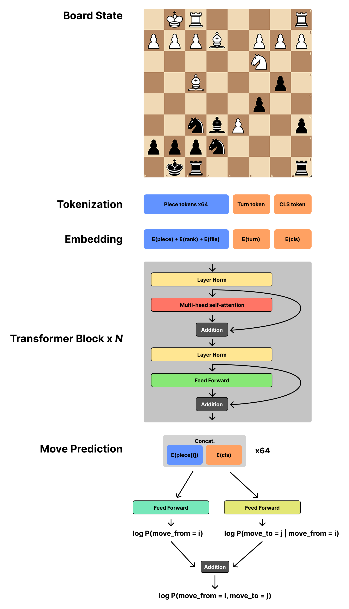

# chet

Chet is a lightweight neural network chess engine trained on human play.

The goal of this project is to create a chess model that is:

-   Small enough to be trained on a single GPU (this is more a constraint arising from limited access to computational resources than an explicit design goal).
-   Accurate enough to be useful.
-   Produces human-like moves, even where not optimal.

While the current state-of-the-art chess engines such as [Stockfish](https://stockfishchess.org/) far exceed the ability of top human players and can be considered, for most practical purposes, optimal, the moves produced by these engines lack interpretability and are far removed from the style of play that even top human players would make. This project aims to create a chess foundation model that can be used in applications such as training, analysis, and the creation of chess agents that can be fine-tuned to emulate specific levels or even the styles of individual players.

## Architecture

Chet is a decoder-only transformer model based loosely on [GPT-2](https://cdn.openai.com/better-language-models/language_models_are_unsupervised_multitask_learners.pdf) that outputs move predictions as a probability distribution over all `4096 = 64 * 64` possible moves given the current board state. Chet is small; about a thousand times smaller than some models used in the state-of-the-art.

<p align="center">
    
</p>

## Dataset

Chet is trained on positions taken from the [Lichess Elite Database](https://database.nikonoel.fr/), which was in turn derived from the [Lichess Open Database](https://database.lichess.org/). A proportion of the training data was also taken from the [Lichess Puzzles Dataset](https://database.lichess.org/#puzzles) in order to improve the model's explicit handling of tactical patterns.

## Pretrained Models

Weights for pretrained models are publically available but are not included in the repository due to their large size. Models may be loaded from a model file via `Chet.from_pretrained(path, config)`. The values of `ModelConfig` must match the training configuration used to generate the model file.

### Chet-33M

-   Model size: 32,535,893 parameters
-   Model file: [Google Drive](https://drive.google.com/file/d/1ypObrVRd_lXlVFABXb-o4u8koElxbiYE/view?usp=sharing)
-   Training set: 5M positions
-   Performance: 79.5% accuracy on 10k positions taken from the Lichess puzzles dataset.
-   Last updated: 2025-02-14 (this is what I'm busy doing on Valentine's Day btw)

Configuration:

```python
config = ModelConfig(
    embed_dim=468,
    n_heads=12,
    n_layers=12,
    dropout=0.1,
)
```

## Example Pytorch Usage

`chet.model.Chet` is a subclass of `torch.nn.Module`. Example usage is as follows:

```python
from chet.model import Chet, ModelConfig
from chet.tokenizer import tokenize_board
import chess
import torch.nn.functional as F

model = Chet.from_pretrained("path/to/model.pt", ModelConfig(), device="cuda")

# tokenization
board = chess.Board("rnbqkbnr/pppppppp/8/8/8/8/PPPPPPPP/RNBQKBNR w KQkq - 0 1")
board_tokens = tokenize_board(board)

# forward pass
move_logits = model(board_tokens)
move_probs = F.softmax(move_logits / temperature, dim=-1)[0]  # [4096]
```

## Tree Search

Chet provides an optional tree search function (`chet.tree_search.chet_tree_search`) that augments the move selection process with explicit minimax game tree search using a simple material evaluation function. This function overrides the default move sampling function to play moves that would lead to a substantial material gain (or win) and also ensures that moves which would lead to a large material loss (or loss) are never played. The internal tree search is optimized by only considering moves to which the model assigns a significant probability. This reduces the branching factor of the tree search dramatically.

As it stands, the model will occasionally play blundering moves or miss opportunities, and this function is designed to mitigate these issues.

## Limitations

-   Special board state information such as en passant and castling rights are not encoded in the current tokenization scheme. Castling rights can generally be inferred from the board state based on the position of the king and rooks, but en passant cannot.
-   Stalemate conditions such as the fifty-move rule and threefold repetition are not encoded. The model is not given any information about past board states.
-   The model often struggles to convert endgame positions into checkmates, often accidentally creating a stalemate. From empirical testing, the model does not efficiently utilize its material advantage to create checkmates, instead preferring to create as many queens as possible.
-   From empirical testing, the model struggles to recognize moves which create discovered attacks.

## Related Works

-   [Chess Transformers](https://github.com/sgrvinod/chess-transformers), a similarly-sized model that uses a different architecture.
-   [Leela Chess Zero](https://github.com/LeelaChessZero/lc0), another, far larger neural network chess engine based on the transformer architecture.
-   [Maia Chess](https://www.maiachess.com/), a version of AlphaZero that has been fine-tuned with the goal of producing more human-like play.
